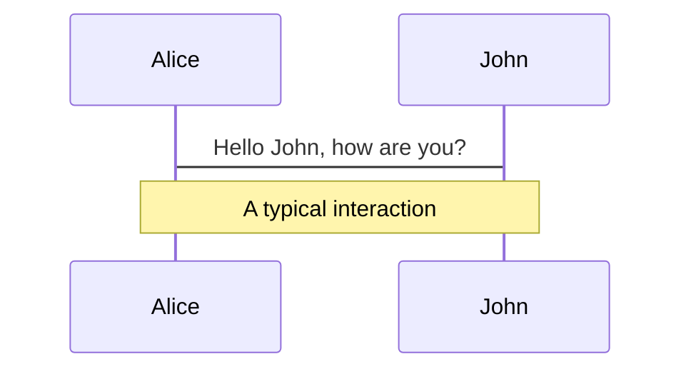
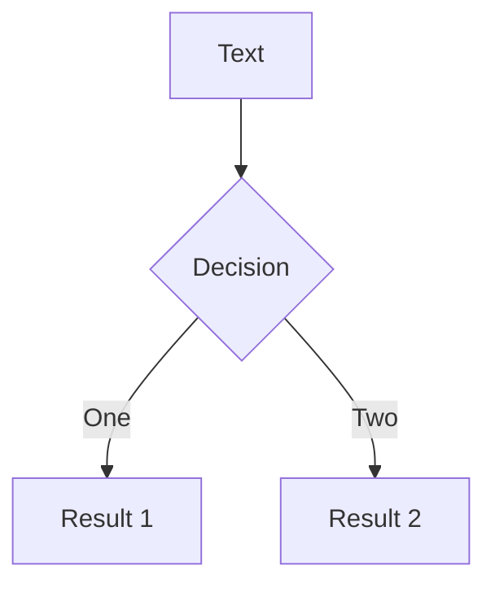

# Modular Frontends

---

# Introducing Module Federation! 🎉

Module Federation aims to solve the sharing of modules in a distributed system.

There are two main concepts to get your head around: the Host's and the Remote's.

- **Host**
  - It loads all the initial chunks, boots the app and renders what the user will see first
  - It will reference the remotely bundled shared components.
<br>
<br>

```javascript
const ModuleReferencePlugin = require("webpack/lib/container/ContainerReferencePlugin");

new ModuleReferencePlugin({
    remoteType: 'global',
    remotes: ['app_two', 'app_three'],
    overrides: {
        react: 'react',
    }
});
```

---

# Introducing Module Federation! 🎉

- **Remote**
  - A remote's job is to offer up, or rather expose modules that can be consumed by the host.
  - allowing the remote to not have to download shared dependencies.
<br>
<br>

```javascript
const ModuleContainerPlugin = require("webpack/lib/container/ContainerPlugin");

new ModuleContainerPlugin({
    name: 'app_two', 
    library: { type: 'global', name: 'app_two' },
    shared: {
        react: 'react',
    },
    exposes: {
      Title: './src/components/Title'
    }
});
```

---

# Federation Plugin 🕺

But most of the time, you will want your apps to both expose and/or consume federated modules.
<br>
<br>

```javascript
const ModuleFederationPlugin = require("webpack/lib/container/ModuleFederationPlugin");

new ModuleFederationPlugin({
    name: 'app_two',
    library: { type: 'global', name: 'app_two' },
    remotes: {
      app_one: 'app_one',
      app_three: 'app_three'
    },
    exposes: {
       AppContainer: './src/App'
    },
    shared: ['react', 'react-dom']
}),

```

---

# Diagrams

You can create diagrams / graphs from textual descriptions, directly in your Markdown.

<div class="grid grid-cols-2 gap-4 pt-4 -mb-6">





</div>

[Learn More](https://sli.dev/guide/syntax.html#diagrams)

